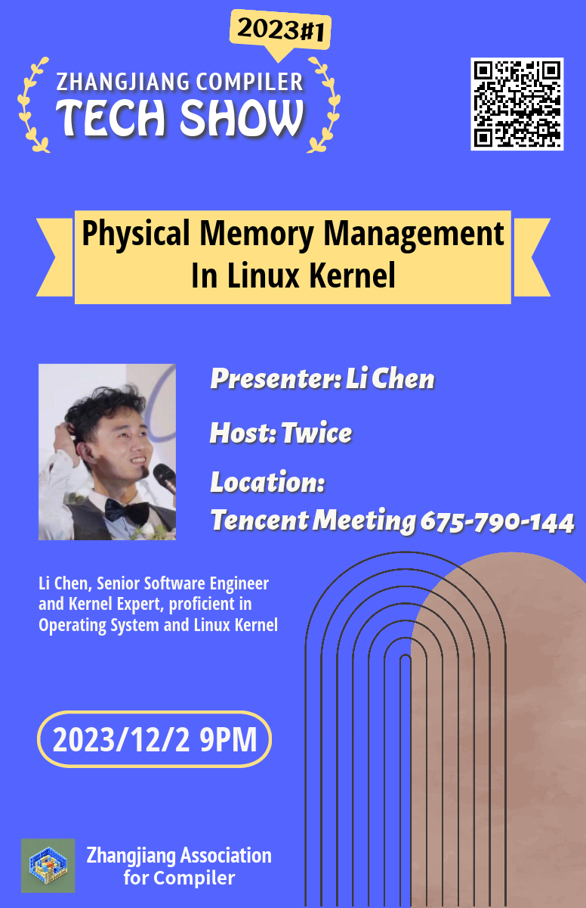

Zhangjiang Compiler Tech Show
===

## Upcoming

## History

No.|Date|Title|Presenter|Host|Resource Links
-|-|-|-|-|-
2023.1|2023/12/2|Physical Memory Management in Linux Kernel|Li Chen|Twice|[slides](https://docs.google.com/presentation/d/e/2PACX-1vTbcb8EtaMtGrfIHRKWSb8Dpg2GpMIyCLrAyoKOezkB6lkw6jtY-k8G9Sh1aWyFxYe3iwlDsW7m3tvP/pub?start=false&loop=false&delayms=3000), video (TBD), [Discussion](https://github.com/zhangjiang-compiler/tech-show/discussions/2) | 
